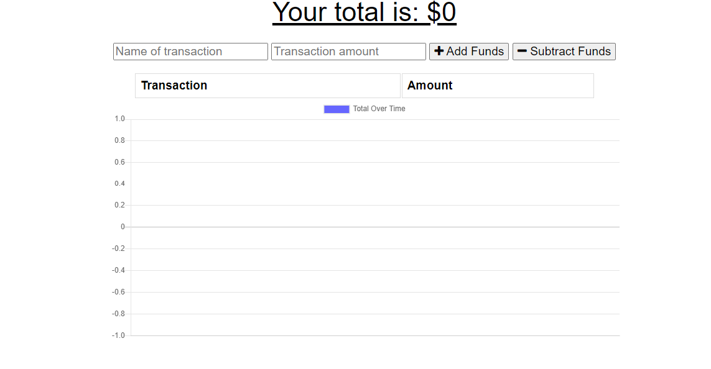

# Budget_Tracker
A PWA to keep track of a budget.

## Project Description

This is a PWA designed to keep a running record of how much are spending across multiple transactions. User is able to enter name of transaction, as well as amount, to calculate how much is being spent overall.

## Links

- Heroku: https://budget-tracker-so.herokuapp.com/

- Gitub: https://sterlingorth.github.io/Budget_Tracker/

- Source Code: https://github.com/SterlingOrth/Budget_Tracker.git
